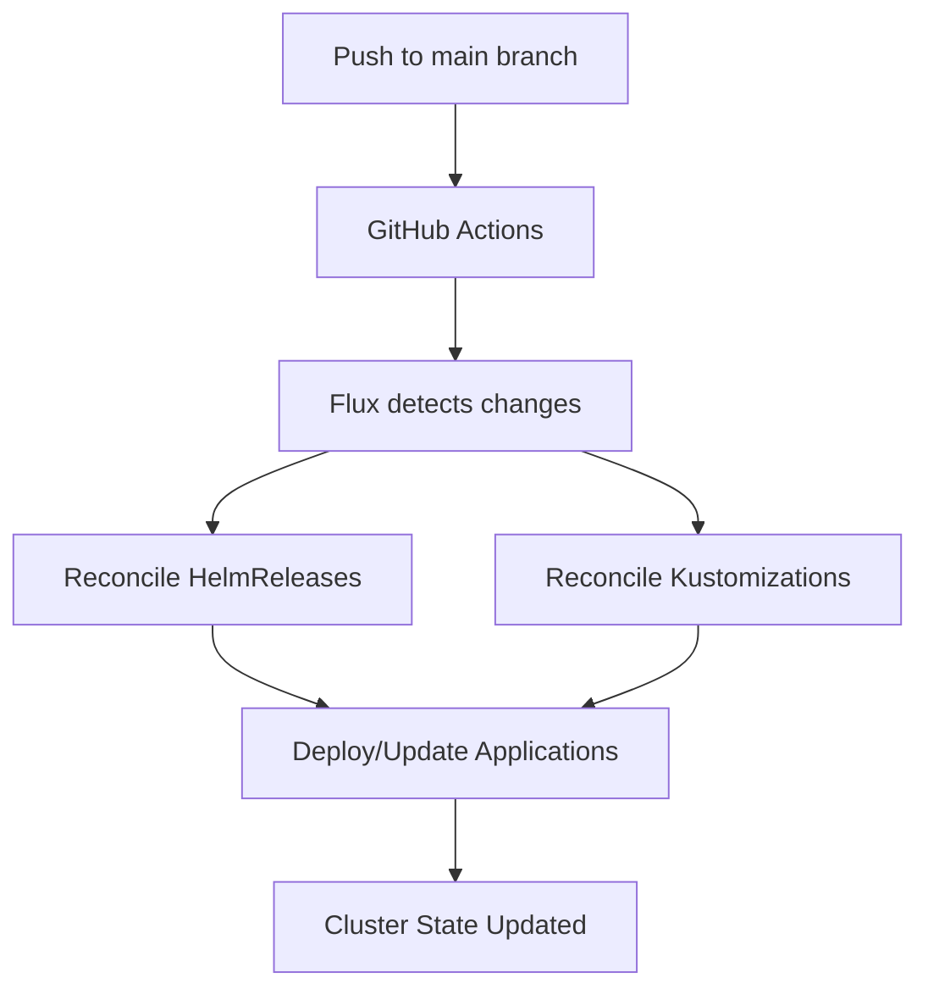
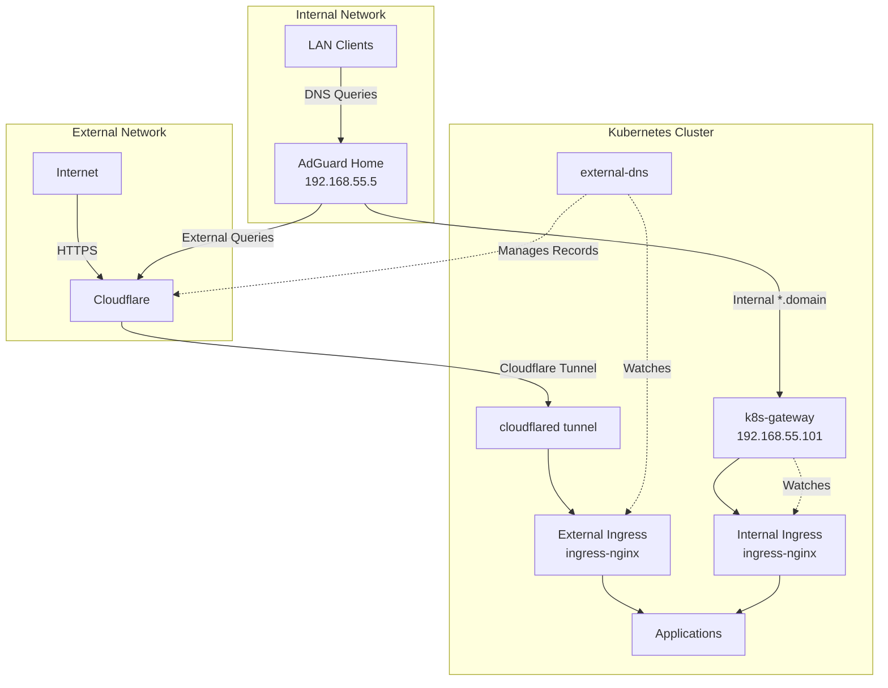

<div align="center">

### 🚀 My Home Operations Repository 🏠

_... managed with Talos, Flux, and GitHub Actions_ 🤖

</div>

<div align="center">

[](https://www.talos.dev)&nbsp;&nbsp;
[](https://kubernetes.io)&nbsp;&nbsp;
[](https://fluxcd.io)&nbsp;&nbsp;
[](https://github.com/renovatebot/renovate)&nbsp;&nbsp;
[](https://github.com/getsops/sops)

</div>

---

## 💡 Overview

This is a mono repository for my home infrastructure and Kubernetes cluster. I adhere to Infrastructure as Code (IaC) and GitOps practices using tools like [Talos](https://www.talos.dev/), [Kubernetes](https://kubernetes.io/), [Flux](https://github.com/fluxcd/flux2), [Renovate](https://github.com/renovatebot/renovate), and [GitHub Actions](https://github.com/features/actions).

My setup focuses on running containerized applications on a robust Kubernetes platform with integrated DNS filtering via AdGuard Home, automated backups, and comprehensive monitoring.

---

## 🌱 Kubernetes

My Kubernetes cluster is deployed on [Talos Linux](https://www.talos.dev) running on 3x Intel NUC14 Pro systems. This provides an immutable, secure, and minimal Linux distribution specifically designed for Kubernetes. The cluster uses a hyper-converged architecture where all nodes serve as both control plane and worker nodes.

### Core Components

- **Operating System**: [Talos Linux v1.11.0](https://www.talos.dev/) provides immutable infrastructure and secure-by-default configuration
- **Container Runtime**: [Containerd 2.0.2](https://containerd.io/) with [Spegel](https://github.com/spegel-org/spegel) for distributed container image caching
- **Networking**: [Cilium](https://github.com/cilium/cilium) provides eBPF-based networking, load balancing, and network security
- **Storage**: [Longhorn](https://github.com/longhorn/longhorn) provides distributed storage with replication and backup capabilities
- **Service Mesh**: Internal and external ingress via [ingress-nginx](https://github.com/kubernetes/ingress-nginx)
- **DNS & Security**: [AdGuard Home](https://github.com/AdguardTeam/AdGuardHome) provides network-wide ad blocking and recursive DNS resolution
- **GitOps**: [Flux](https://github.com/fluxcd/flux2) monitors this repository and keeps the cluster in sync
- **Secrets Management**: [SOPS](https://github.com/getsops/sops) with [age encryption](https://github.com/FiloSottile/age) for storing secrets in Git
- **Certificate Management**: [cert-manager](https://github.com/cert-manager/cert-manager) with Let's Encrypt for automated TLS certificates

### GitOps Workflow

[Flux](https://github.com/fluxcd/flux2) watches this repository and automatically applies changes to the cluster. The workflow follows this pattern:



[Renovate](https://github.com/renovatebot/renovate) automatically creates pull requests for dependency updates, ensuring the cluster stays current with the latest stable releases.

---

## ⚙️ Hardware

The cluster runs on enterprise-grade Intel NUC systems with high-speed networking and ample resources for containerized workloads:

| Node | Model | CPU | Memory | Storage | Network | Role |
|------|-------|-----|---------|---------|---------|------|
| k8s-nuc14-01 | Intel NUC14 Pro | 18 cores | ~64GB | NVMe SSD | 2.5GbE | Control Plane + Worker |
| k8s-nuc14-02 | Intel NUC14 Pro | 18 cores | ~64GB | NVMe SSD | 2.5GbE | Control Plane + Worker |
| k8s-nuc14-03 | Intel NUC14 Pro | 18 cores | ~64GB | NVMe SSD | 2.5GbE | Control Plane + Worker |

**Additional Infrastructure:**
- **NAS**: UNAS-CBERG at `192.168.31.230` provides bulk storage, backups, and SMB/NFS shares
- **Network**: UniFi infrastructure with 10GbE backbone and 2.5GbE to compute nodes

---

## 🌐 Network Architecture

The network is built on UniFi equipment providing enterprise-grade performance and centralized management:

```
Internet (Deutsche Telekom)
         |
    [DMP-CBERG] (UniFi Dream Machine Pro)
         |
   [SW-48-PoE] (48-port 10GbE Core Switch)
         |
   [SW-24-PoE] (24-port Distribution Switch)
    /    |    \
   /     |     \
NUCs  UNAS   [APs] (U6+, U6 Pro, U7 Pro, UAP AC LR)
```

**Key Network Components:**
- **Gateway**: DMP-CBERG (UniFi Dream Machine Pro) - Routing, firewall, IDS/IPS
- **Core Switch**: Basement-SW-48 with 10GbE SFP+ uplinks
- **Distribution**: Basement-SW-24-PoE with 2.5GbE to compute nodes
- **Access Points**: Strategic placement for full wireless coverage
- **Storage**: UNAS-CBERG connected via 10GbE SFP+ for high-speed data access

---

## 🛡️ DNS & Security

The cluster implements a multi-layered DNS architecture combining internal service discovery, external DNS automation, and secure external access through Cloudflare Tunnel.

### DNS Architecture Overview



### AdGuard Home - Network DNS & Ad Blocking

[AdGuard Home](kubernetes/apps/network/internal/adguard-home/app/helmrelease.yaml) provides network-wide ad blocking and DNS resolution:

**Configuration:**
- **Service IP**: `192.168.55.5` (LoadBalancer via Cilium LBIPAM)
- **Web Interface**: Available via internal ingress with TLS
- **DNS Protocols**: Standard DNS (53), DNS-over-TLS (853), DNS-over-HTTPS via ingress
- **Upstream Resolvers**:
  - Cloudflare DNS-over-HTTPS (1.1.1.1) and DNS-over-TLS for public domains
  - Quad9 DNS-over-HTTPS (9.9.9.9) for redundancy
- **Split-DNS Configuration**:
  - Internal domains (`*.${SECRET_DOMAIN}`) → Forward to k8s-gateway at `192.168.55.101`
  - External domains → Resolve via Cloudflare/Quad9
  - Ad blocking rules applied to all external queries

**Client Configuration:**
- UniFi DHCP server pushes `192.168.55.5` as primary DNS to all LAN clients
- Clients can optionally use encrypted DNS via DoT (port 853) or DoH (via ingress)
- All DNS queries benefit from network-wide ad blocking and malware protection

### k8s-gateway - Internal Service Discovery

[k8s-gateway](kubernetes/apps/network/internal/k8s-gateway/helmrelease.yaml) provides DNS resolution for internal Kubernetes services:

**Configuration:**
- **Service IP**: `192.168.55.101` (LoadBalancer via Cilium LBIPAM)
- **Domain**: `*.${SECRET_DOMAIN}` (configured in cluster secrets)
- **Function**: Resolves DNS queries for services with `ingress-class: internal`
- **Watched Resources**: Ingress and Service objects in the cluster
- **TTL**: 1 second for fast failover and updates

**How It Works:**
1. k8s-gateway watches all Ingress resources with `ingressClassName: internal`
2. When a client queries `service.${SECRET_DOMAIN}`, AdGuard Home forwards to k8s-gateway
3. k8s-gateway returns the internal ingress LoadBalancer IP
4. Client connects directly to the service via internal network

**Example:**
```
home-assistant.${SECRET_DOMAIN} → 192.168.55.101 → Internal Ingress → Home Assistant Pod
```

### external-dns - Automated DNS Management

[external-dns](kubernetes/apps/network/external/external-dns/helmrelease.yaml) automatically manages DNS records in Cloudflare:

**Configuration:**
- **Provider**: Cloudflare DNS with API token authentication
- **Domain Filter**: `${SECRET_DOMAIN}` (configured in cluster secrets)
- **Sources**: Ingress resources with `ingressClassName: external` and DNSEndpoint CRDs
- **Record Type**: CNAME records proxied through Cloudflare
- **TXT Ownership**: `k8s.` prefix for record ownership tracking

**How It Works:**
1. external-dns watches Ingress resources with `ingressClassName: external`
2. For each external ingress with annotation `external-dns.alpha.kubernetes.io/target: "external.${SECRET_DOMAIN}"`
3. Creates a CNAME record: `service.${SECRET_DOMAIN} → external.${SECRET_DOMAIN}`
4. Cloudflare proxies the request through their CDN for DDoS protection

**DNSEndpoint CRD:**
The master CNAME record is managed via DNSEndpoint:
```yaml
external.${SECRET_DOMAIN} → ${TUNNEL_ID}.cfargotunnel.com
```

### Cloudflare Tunnel - Secure External Access

[cloudflared](kubernetes/apps/network/external/cloudflared/helmrelease.yaml) provides secure external access without opening firewall ports:

**Configuration:**
- **Tunnel Mode**: Runs as a Cloudflare Tunnel client
- **Protocol**: QUIC with post-quantum encryption support
- **Target**: Routes to external ingress-nginx LoadBalancer
- **Authentication**: Tunnel credentials stored in secret

**How It Works:**
1. cloudflared establishes an outbound connection to Cloudflare's network
2. External requests to `*.${SECRET_DOMAIN}` hit Cloudflare's edge
3. Cloudflare proxies the request through the encrypted tunnel
4. Request arrives at external ingress-nginx in the cluster
5. ingress-nginx routes to the appropriate service

**Security Benefits:**
- No inbound firewall rules required
- All traffic encrypted through Cloudflare Tunnel
- DDoS protection via Cloudflare's network
- Web Application Firewall (WAF) protection
- Automatic TLS/SSL via Cloudflare

### Traffic Flow Examples

**Internal Access (LAN Client → Internal Service):**
```
Client → AdGuard Home (192.168.55.5)
       → k8s-gateway (192.168.55.101)
       → Internal Ingress
       → Service Pod
```

**External Access (Internet → Public Service):**
```
Internet → Cloudflare DNS (${SECRET_DOMAIN})
        → Cloudflare CDN (proxied)
        → Cloudflare Tunnel (QUIC/TLS)
        → cloudflared pod
        → External Ingress
        → Service Pod
```

---

## 📦 Applications

The cluster hosts a variety of applications organized by functional category:

### 🏠 Home Automation
- **Home Assistant** - Central home automation platform
- **ESPHome** - ESP device management and configuration  
- **Node-RED** - Flow-based automation and integration
- **Frigate NVR** - AI-powered network video recorder
- **Scrypted NVR** - Additional video management platform
- **Zigbee2MQTT** - Zigbee device integration via MQTT
- **Mosquitto** - MQTT broker for IoT communications
- **Music Assistant** - Multi-room audio management

### 🌐 Network Services  
- **AdGuard Home** - Network-wide ad blocking at `192.168.55.5`
- **Ingress NGINX** - Internal and external reverse proxy
- **Cloudflared** - Cloudflare Tunnel for external access
- **External DNS** - Automatic DNS record management
- **k8s-gateway** - Internal DNS resolution for cluster services

### 📊 Monitoring & Observability
- **Grafana** - Data visualization and dashboards
- **Prometheus Stack** - Metrics collection and alerting  
- **Uptime Kuma** - Service monitoring and status pages
- **Kubernetes Dashboard** - Cluster management interface

### 🎬 Media & Entertainment
- **Plex** - Media server for streaming content
- **Jellyfin** - Open-source media server alternative
- **TubeArchivist** - YouTube content archival and management
- **MakeMKV** - Blu-ray and DVD ripping utility

### 🗄️ Databases
- **MariaDB** - Primary relational database
- **InfluxDB** - Time-series database for metrics
- **phpMyAdmin** - Database administration interface

### 🤖 AI & Machine Learning  
- **Ollama** - Local LLM inference server
- **Open WebUI** - Chat interface for AI models
- **Langfuse** - LLM observability and analytics

### 📄 Office & Productivity
- **Nextcloud** - Self-hosted cloud storage and collaboration
- **Paperless-ngx** - Document management and OCR

### 💾 Storage & Backup
- **Longhorn** - Distributed storage with replication 
- **Kopia** - Backup and snapshot management
- **iCloud Drive Sync** - Apple iCloud integration

### 🔧 System Services
- **cert-manager** - Automated TLS certificate management
- **Cilium** - eBPF-based networking and security
- **CoreDNS** - Cluster DNS resolution  
- **CSI Driver SMB** - SMB/CIFS storage integration
- **Intel Device Plugin** - GPU acceleration support
- **Local Path Provisioner** - Local storage provisioning
- **Metrics Server** - Resource usage metrics
- **Node Feature Discovery** - Hardware feature detection
- **Reloader** - Automatic pod restart on config changes
- **Spegel** - Distributed container image mirroring

### 🛠️ Custom Applications
- **Absenty** - Custom development and production deployments

### 🔍 Utilities

The repository includes helpful tools for infrastructure management:

- **[SNMP Temperature Scanner](tools/snmp-temp-scan.sh)** - Discovers temperature sensors across UniFi devices for integration with Uptime Kuma monitoring

---

## 🔄 Repository Structure  

This Git repository contains the following directories:

```sh
📁 kubernetes
├── 📁 apps           # Applications organized by category
├── 📁 bootstrap      # Talos and cluster bootstrap configuration  
├── 📁 components     # Reusable Kustomize components
└── 📁 flux           # Flux system configuration
📁 tools              # Utility scripts and automation helpers
📁 docs               # Documentation and diagrams
```

---

## 🔧 Development

### Prerequisites & Tool Management

This repository uses [mise](https://mise.jdx.dev/) for unified development tool management. All required tools are defined in [`.mise.toml`](.mise.toml) and automatically installed and configured when you enter the project directory.

**Managed Tools:**
- **Python 3.13** - For automation scripts and utilities
- **uv** - Fast Python package installer
- **kubectl 1.34.0** - Kubernetes CLI
- **flux 2.4.0** - GitOps toolkit CLI
- **talosctl 1.11.0** - Talos Linux management
- **talhelper 3.0.37** - Talos configuration helper
- **sops 3.9.4** - Secrets encryption
- **helm 3.17.1** - Kubernetes package manager
- **kustomize 5.6.0** - Kubernetes manifest customization
- **age 1.2.1** - Encryption tool for SOPS
- **Additional utilities**: jq, yq, cloudflared, gum, kubeconform

**Environment Variables:**

When in the project directory, mise automatically sets:
```bash
KUBECONFIG=$PWD/kubeconfig              # Cluster access
KUBERNETES_DIR=$PWD/kubernetes          # Kubernetes manifests
SOPS_AGE_KEY_FILE=$PWD/age.key         # SOPS encryption key
TALOSCONFIG=$PWD/kubernetes/bootstrap/talos/clusterconfig/talosconfig
VIRTUAL_ENV=$PWD/.venv                  # Python virtual environment
```

### Getting Started

```bash
# Install mise (if not already installed)
# macOS: brew install mise
# Other: https://mise.jdx.dev/getting-started.html

# Trust and install all tools
mise trust
mise install

# Environment is auto-configured when entering directory
# Verify tools are available
mise ls
python --version   # Python 3.13.8
kubectl version    # kubectl 1.34.0
flux version       # flux 2.4.0

# Access cluster (KUBECONFIG already set by mise)
kubectl get nodes

# Monitor Flux
flux get kustomizations -A
flux get helmreleases -A

# Debug applications
kubectl get pods -A
kubectl logs -n <namespace> <pod-name>

# Upgrade tools to latest versions
mise upgrade
mise prune  # Clean up old versions
```

---

## 🙏 Acknowledgements

This repository was inspired by the excellent work of [onedr0p](https://github.com/onedr0p) and the [home-ops](https://github.com/onedr0p/home-ops) repository. Special thanks to the broader [Home Operations Discord community](https://discord.gg/home-operations) for sharing knowledge and best practices.

Additional inspiration from:
- [Talos Linux](https://www.talos.dev/) for providing an excellent Kubernetes-focused OS
- [Flux](https://fluxcd.io/) community for GitOps guidance
- [k8s-at-home](https://k8s-at-home.com/) project for application examples

---

## 📄 License

This repository is available under the [MIT License](LICENSE).
