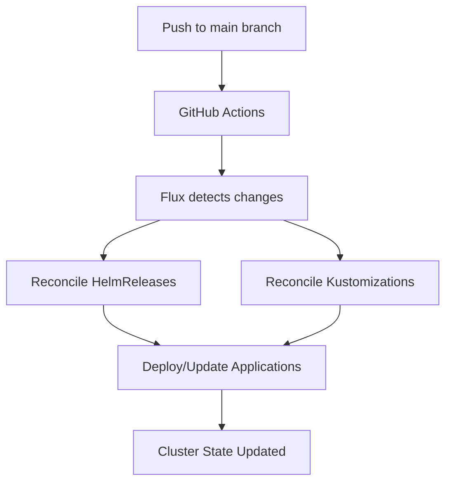
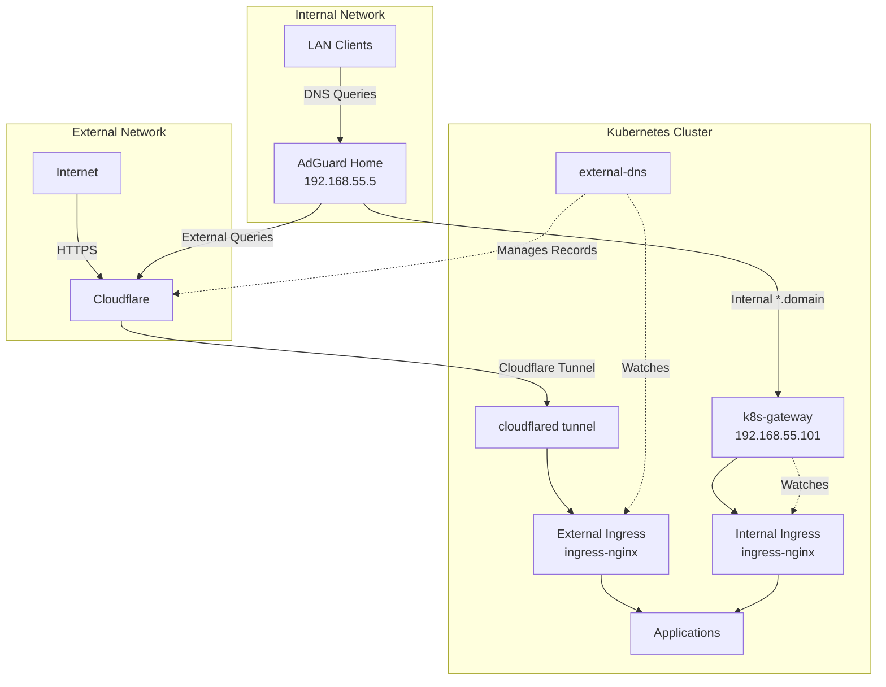

<div align="center">

### 🚀 My Home Operations Repository 🏠

_... managed with Talos, Flux, and GitHub Actions_ 🤖

</div>

<div align="center">

[](https://www.talos.dev)&nbsp;&nbsp;
[](https://kubernetes.io)&nbsp;&nbsp;
[](https://fluxcd.io)&nbsp;&nbsp;
[](https://github.com/renovatebot/renovate)&nbsp;&nbsp;
[](https://github.com/getsops/sops)

</div>

---

## 💡 Overview

This is a mono repository for my home infrastructure and Kubernetes cluster. I adhere to Infrastructure as Code (IaC) and GitOps practices using tools like [Talos](https://www.talos.dev/), [Kubernetes](https://kubernetes.io/), [Flux](https://github.com/fluxcd/flux2), [Renovate](https://github.com/renovatebot/renovate), and [GitHub Actions](https://github.com/features/actions).

My setup focuses on running containerized applications on a robust Kubernetes platform with integrated DNS filtering via AdGuard Home, automated backups, and comprehensive monitoring.

---

## 🌱 Kubernetes

My Kubernetes cluster is deployed on [Talos Linux](https://www.talos.dev) running on 3x Intel NUC14 Pro systems. This provides an immutable, secure, and minimal Linux distribution specifically designed for Kubernetes. The cluster uses a hyper-converged architecture where all nodes serve as both control plane and worker nodes.

### Core Components

- **Operating System**: [Talos Linux v1.13.4](https://www.talos.dev/) provides immutable infrastructure and secure-by-default configuration (kernel 6.18.34, Clang/ThinLTO build)
- **Container Runtime**: [Containerd 2.2.3](https://containerd.io/) with [Spegel](https://github.com/spegel-org/spegel) for distributed container image caching
- **Networking**: [Cilium v1.19.3](https://github.com/cilium/cilium) provides eBPF-based networking, load balancing, and network security
- **Storage**: [Longhorn v1.11.2](https://github.com/longhorn/longhorn) provides distributed storage with replication and backup capabilities
- **Service Mesh**: Internal and external ingress via [ingress-nginx](https://github.com/kubernetes/ingress-nginx)
- **Identity**: [Authentik](https://goauthentik.io/) is the cluster IdP — forward-auth for internal apps, SAML SSO for Wazuh, OIDC for selected apps. Blueprints are managed as code in `kubernetes/apps/kube-system/authentik/app/configmap.sops.yaml` (see `docs/sops/authentik.md`).
- **Security / SIEM**: [Wazuh 4.14.5](https://wazuh.com/) (single-node Manager + Indexer + Dashboard) ingests Talos node logs, K8s container logs, UniFi CEF syslog, and [Falco](https://falco.org/) runtime syscall events. Custom decoders for UniFi and ingress-nginx (cf_connecting_ip correlation).
- **DNS & Security**: [AdGuard Home](https://github.com/AdguardTeam/AdGuardHome) provides network-wide ad blocking and recursive DNS resolution
- **GitOps**: [Flux v2.5.0](https://github.com/fluxcd/flux2) (distribution) monitors this repository and keeps the cluster in sync
- **Secrets Management**: [SOPS](https://github.com/getsops/sops) with [age encryption](https://github.com/FiloSottile/age) for storing secrets in Git
- **Certificate Management**: [cert-manager v1.20.2](https://github.com/cert-manager/cert-manager) with Let's Encrypt for automated TLS certificates

### GitOps Workflow

[Flux](https://github.com/fluxcd/flux2) watches this repository and automatically applies changes to the cluster. The workflow follows this pattern:


```mermaid
graph TD
    A[Push to main branch] --> B[GitHub Actions]
    B --> C[Flux detects changes]
    C --> D[Reconcile HelmReleases]
    C --> E[Reconcile Kustomizations] 
    D --> F[Deploy/Update Applications]
    E --> F
    F --> G[Cluster State Updated]
```

[Renovate](https://github.com/renovatebot/renovate) automatically creates pull requests for dependency updates, ensuring the cluster stays current with the latest stable releases.

---

## ⚙️ Hardware

The cluster runs on enterprise-grade Intel NUC systems with high-speed networking and ample resources for containerized workloads:

| Node | Model | CPU | Memory | Storage | Network | Role |
|------|-------|-----|---------|---------|---------|------|
| k8s-nuc14-01 | Intel NUC14 Pro | 18 cores | ~64GB | NVMe SSD | GbE (uplink 10GbE) | Control Plane + Worker |
| k8s-nuc14-02 | Intel NUC14 Pro | 18 cores | ~64GB | NVMe SSD | GbE (uplink 10GbE) | Control Plane + Worker |
| k8s-nuc14-03 | Intel NUC14 Pro | 18 cores | ~64GB | NVMe SSD | GbE (uplink 10GbE) | Control Plane + Worker |

**Additional Infrastructure:**
- **NAS**: UNAS-CBERG at `192.168.31.230` provides bulk storage, backups, and SMB/NFS shares
- **AI Compute**: Mac Mini M4 Pro (`192.168.30.111`) running Ollama on port 11434 with gemma 4 for GPU-accelerated LLM inference with Metal Performance Shaders (MPS). Provides OpenAI-compatible API endpoints for cluster applications.
- **Remote Management**: PiKVM devices provide KVM-over-IP access to all Kubernetes nodes
- **Network**: UniFi infrastructure with 10GbE backbone and 2.5GbE to compute nodes

---

## 🌐 Network Architecture

The network is built on UniFi equipment providing enterprise-grade performance and centralized management:

```
Internet (Deutsche Telekom)
         |
    [DMP-CBERG] (UniFi Dream Machine Pro)
         |
   [SW-48-PoE] (48-port 10GbE Core Switch)
         |
   [SW-24-PoE] (24-port Distribution Switch)
    /    |    \
   /     |     \
NUCs  UNAS   [APs] (U6+, U6 Pro, U7 Pro, UAP AC LR)
```

**Key Network Components:**
- **Gateway**: DMP-CBERG (UniFi Dream Machine Pro) - Routing, firewall, IDS/IPS, WireGuard VPN
- **Core Switch**: Basement-SW-48 with 10GbE SFP+ uplinks
- **Distribution**: Basement-SW-24-PoE with 2.5GbE to compute nodes
- **Access Points**: Strategic placement for full wireless coverage (U6+, U6 Pro, U7 Pro, UAP AC LR)
- **Storage**: UNAS-CBERG connected via 10GbE SFP+ for high-speed data access
- **Remote Management**: PiKVM devices for KVM-over-IP access to Kubernetes nodes
- **AI Compute**: Mac Mini M4 Pro (`192.168.30.111`) running Ollama on port 11434 with gemma 4 and Metal acceleration. Endpoint accessible at `http://192.168.30.111:11434/api`

---

## 🛡️ DNS & Security

The cluster implements a multi-layered DNS architecture combining internal service discovery, external DNS automation, and secure external access through Cloudflare Tunnel.

### DNS Architecture Overview


```mermaid
graph TB
    subgraph "External Network"
        Internet[Internet]
        CF[Cloudflare]
    end

    subgraph "Internal Network"
        Clients[LAN Clients]
        AdGuard[AdGuard Home<br/>192.168.55.5]
    end

    subgraph "Kubernetes Cluster"
        K8sGW[k8s-gateway<br/>192.168.55.101]
        ExtDNS[external-dns]
        CloudFlared[cloudflared tunnel]
        ExtIngress[External Ingress<br/>ingress-nginx]
        IntIngress[Internal Ingress<br/>ingress-nginx]
        Apps[Applications]
    end

    Internet -->|HTTPS| CF
    CF -->|Cloudflare Tunnel| CloudFlared
    CloudFlared --> ExtIngress
    ExtIngress --> Apps

    Clients -->|DNS Queries| AdGuard
    AdGuard -->|Internal *.domain| K8sGW
    AdGuard -->|External Queries| CF
    K8sGW --> IntIngress
    IntIngress --> Apps

    ExtDNS -.->|Manages Records| CF
    K8sGW -.->|Watches| IntIngress
    ExtDNS -.->|Watches| ExtIngress
```

### AdGuard Home - Network DNS & Ad Blocking

[AdGuard Home](kubernetes/apps/network/internal/adguard-home/app/helmrelease.yaml) provides network-wide ad blocking and DNS resolution:

**Configuration:**
- **Service IP**: `192.168.55.5` (LoadBalancer via Cilium LBIPAM)
- **Web Interface**: Available via internal ingress with TLS
- **DNS Protocols**: Standard DNS (53), DNS-over-TLS (853), DNS-over-HTTPS via ingress
- **Upstream Resolvers**:
  - Cloudflare DNS-over-HTTPS (1.1.1.1) and DNS-over-TLS for public domains
  - Quad9 DNS-over-HTTPS (9.9.9.9) for redundancy
- **Split-DNS Configuration**:
  - Internal domains (`*.${SECRET_DOMAIN}`) → Forward to k8s-gateway at `192.168.55.101`
  - External domains → Resolve via Cloudflare/Quad9
  - Ad blocking rules applied to all external queries

**Client Configuration:**
- UniFi DHCP server pushes `192.168.55.5` as primary DNS to all LAN clients
- Clients can optionally use encrypted DNS via DoT (port 853) or DoH (via ingress)
- All DNS queries benefit from network-wide ad blocking and malware protection

### k8s-gateway - Internal Service Discovery

[k8s-gateway](kubernetes/apps/network/internal/k8s-gateway/helmrelease.yaml) provides DNS resolution for internal Kubernetes services:

**Configuration:**
- **Service IP**: `192.168.55.101` (LoadBalancer via Cilium LBIPAM)
- **Domain**: `*.${SECRET_DOMAIN}` (configured in cluster secrets)
- **Function**: Resolves DNS queries for services with `ingress-class: internal`
- **Watched Resources**: Ingress and Service objects in the cluster
- **TTL**: 1 second for fast failover and updates

**How It Works:**
1. k8s-gateway watches all Ingress resources with `ingressClassName: internal`
2. When a client queries `service.${SECRET_DOMAIN}`, AdGuard Home forwards to k8s-gateway
3. k8s-gateway returns the internal ingress LoadBalancer IP
4. Client connects directly to the service via internal network

**Example:**
```
home-assistant.${SECRET_DOMAIN} → 192.168.55.101 → Internal Ingress → Home Assistant Pod
```

### external-dns - Automated DNS Management

[external-dns](kubernetes/apps/network/external/external-dns/helmrelease.yaml) automatically manages DNS records in Cloudflare:

**Configuration:**
- **Provider**: Cloudflare DNS with API token authentication
- **Domain Filter**: `${SECRET_DOMAIN}` (configured in cluster secrets)
- **Sources**: Ingress resources with `ingressClassName: external` and DNSEndpoint CRDs
- **Record Type**: CNAME records proxied through Cloudflare
- **TXT Ownership**: `k8s.` prefix for record ownership tracking

**How It Works:**
1. external-dns watches Ingress resources with `ingressClassName: external`
2. For each external ingress with annotation `external-dns.alpha.kubernetes.io/target: "external.${SECRET_DOMAIN}"`
3. Creates a CNAME record: `service.${SECRET_DOMAIN} → external.${SECRET_DOMAIN}`
4. Cloudflare proxies the request through their CDN for DDoS protection

**DNSEndpoint CRD:**
The master CNAME record is managed via DNSEndpoint:
```yaml
external.${SECRET_DOMAIN} → ${TUNNEL_ID}.cfargotunnel.com
```

### Cloudflare Tunnel - Secure External Access

[cloudflared](kubernetes/apps/network/external/cloudflared/helmrelease.yaml) provides secure external access without opening firewall ports:

**Configuration:**
- **Tunnel Mode**: Runs as a Cloudflare Tunnel client
- **Protocol**: QUIC with post-quantum encryption support
- **Target**: Routes to external ingress-nginx LoadBalancer
- **Authentication**: Tunnel credentials stored in secret

**How It Works:**
1. cloudflared establishes an outbound connection to Cloudflare's network
2. External requests to `*.${SECRET_DOMAIN}` hit Cloudflare's edge
3. Cloudflare proxies the request through the encrypted tunnel
4. Request arrives at external ingress-nginx in the cluster
5. ingress-nginx routes to the appropriate service

**Security Benefits:**
- No inbound firewall rules required
- All traffic encrypted through Cloudflare Tunnel
- DDoS protection via Cloudflare's network
- Web Application Firewall (WAF) protection
- Automatic TLS/SSL via Cloudflare

**Zone Settings Management:**

Cloudflare zone settings (SSL mode, TLS version, HSTS, Bot Fight Mode, Block AI Bots) are managed as code via Terraform with state stored in a Kubernetes Secret in `flux-system`. See `docs/sops/cloudflare.md` for the full operational SOP.

```bash
cd terraform/cloudflare
./tf plan    # preview changes
./tf apply   # apply changes
```

### VPN Access - UniFi WireGuard

The UniFi Dream Machine Pro provides secure VPN access for remote administration and internal service access:

**Configuration:**
- **VPN Type**: WireGuard (modern, fast, secure VPN protocol)
- **Managed By**: UniFi Network Controller on DMP-CBERG
- **Use Cases**:
  - Remote access to internal services when away from home
  - Secure administration of Kubernetes cluster and infrastructure
  - Access to PiKVM remote management interfaces
  - Internal DNS resolution via AdGuard Home while connected

**Security Features:**
- Modern cryptography with WireGuard protocol
- Peer-to-peer encryption
- Minimal attack surface
- Split-tunnel support for selective routing
- Integration with UniFi Threat Management

**Access:**
- VPN clients connect to the UniFi Dream Machine Pro
- Once connected, full access to internal network (192.168.x.x)
- Automatic DNS configuration points to AdGuard Home
- Access to all internal services via `*.${SECRET_DOMAIN}`

### Remote Management - PiKVM

PiKVM devices provide hardware-level remote access to Kubernetes nodes for troubleshooting and maintenance:

**Features:**
- **KVM-over-IP**: Full keyboard, video, and mouse access over network
- **Remote Power Control**: Power on/off/reset capabilities for each node
- **BIOS Access**: Pre-boot configuration and troubleshooting without physical access
- **Virtual Media**: Mount ISO images remotely for OS installation or recovery
- **Web Interface**: Browser-based access to console and controls

**Deployment:**
- PiKVM device connected to each Kubernetes node
- Accessible via VPN or internal network
- Provides out-of-band management independent of node OS
- Critical for Talos Linux maintenance and emergency recovery

**Use Cases:**
- BIOS configuration and firmware updates
- Talos Linux installation and bootstrapping
- Emergency recovery when nodes are unresponsive
- Monitoring boot process and troubleshooting hardware issues

### Traffic Flow Examples

**Internal Access (LAN Client → Internal Service):**
```
Client → AdGuard Home (192.168.55.5)
       → k8s-gateway (192.168.55.101)
       → Internal Ingress
       → Service Pod
```

**External Access (Internet → Public Service):**
```
Internet → Cloudflare DNS (${SECRET_DOMAIN})
        → Cloudflare CDN (proxied)
        → Cloudflare Tunnel (QUIC/TLS)
        → cloudflared pod
        → External Ingress
        → Service Pod
```

---

## 🛡️ Identity, SIEM & Runtime Security

Beyond network-layer DNS and tunnel encryption, the cluster runs a dedicated
SIEM + runtime-security stack and a central IdP.

### Authentik — Cluster IdP

[Authentik](kubernetes/apps/kube-system/authentik) is the identity provider for
the cluster. It backs:

- **Forward-auth** for internal apps via ingress-nginx annotations (Homepage,
  most admin UIs).
- **SAML SSO** for Wazuh Dashboard (`run_as: false`, blueprint-managed).
- **OIDC** for selected apps that prefer direct OIDC over forward-auth.

Authentik configuration is managed entirely as blueprints in
`kubernetes/apps/kube-system/authentik/app/configmap.sops.yaml` — never via the
UI. Full workflow: [`docs/sops/authentik.md`](docs/sops/authentik.md).

### Wazuh — SIEM

Single-node deployment in `kubernetes/apps/security/wazuh`:

- **wazuh-manager-master** (4.14.5) — agent enrollment (1515), comms (1514), REST API
  (55000), UniFi CEF syslog listener (UDP 514 on LB IP `192.168.55.27`).
  Custom decoder sets mounted at `etc/decoders/{unifi,ingress-nginx}` and the
  matching `etc/rules/` dirs (each path listed explicitly in `ossec.conf`
  — `<decoder_dir>` is non-recursive).
- **wazuh-indexer** — single-node OpenSearch (ES7 compat) for event storage,
  14d ILM retention.
- **wazuh-dashboard** — fronted by Authentik SAML SSO.
- **wazuh-agent** — DaemonSet, one privileged agent per node with stable
  identity `k8s-nuc14-{01,02,03}` (no zombie agents on DaemonSet rollouts).
  Collects FIM, Talos node logs, every CRI container log (with `wazuh-*` /
  `longhorn-manager-*` / `falco-*` excludes), and Falco syscall events.

Custom rule families:
- `100400-100404` — Falco priority → Wazuh level mapping.
- `100410-100412` — silences for known FP patterns (wazuh-* daemon FIM,
  cilium-cni plugin invocation, postgres `pg_isready` reading `/etc/shadow`).
- `100500-100503` — ingress-nginx CRI/JSON decoder (cf_connecting_ip per-source-IP correlation, 4xx/5xx escalation, scanner detection).

### Falco — Runtime syscall monitoring

[Falco](kubernetes/apps/security/falco) runs as a DaemonSet via the
`modern_ebpf` driver (Talos kernel ≥ 5.8, no kmod build needed). JSON events
are written to `/var/run/falco/falco.log` and tailed by the wazuh-agent
DaemonSet — the manager-side rule chain `100400-100404` surfaces them as
Wazuh alerts. Accepted-risk record: `accepted_risks` table in sweep_history Postgres, AR-026 — browse at `https://sweep.<DOMAIN>/policies/accepted-risks#AR-026`.

### Defense-in-depth checks

- **Pre-commit hook** (`.githooks/pre-commit`) scans staged files against
  decoded values of every in-cluster Secret (10-min cached), warns on
  unencrypted `*.sops.yaml`, and detects common credential patterns. K8s
  resource names are filtered to avoid false positives.
- **Security audit script** (`runbooks/security-check.py`) runs 13 sections
  end-to-end: SOPS coverage, image CVEs (Trivy in parallel), attack patterns,
  external ingress drift vs Cloudflare tunnel, internal mTLS, per-Wazuh-agent
  heartbeat, plus the Wazuh-side SIEM noise floor.

---

## 💾 Storage & Backup

### Longhorn — Distributed block storage

[Longhorn v1.11.2](kubernetes/apps/storage/longhorn) is the default
`StorageClass` for application data. Choose between two classes per the
[`docs/sops/longhorn.md`](docs/sops/longhorn.md) standard:

- **`longhorn`** (dynamic provisioning) — application databases, anything that
  grows over time, StatefulSet volumes. PV names are auto-generated UUIDs.
- **`longhorn-static`** — small config volumes you want to preserve across
  namespace deletes; requires manually pre-creating the Longhorn `Volume` CRD.

### CIFS/SMB to the NAS

The [csi-driver-smb](kubernetes/apps/kube-system/csi-driver-smb) connects
cluster pods to bulk shares on UNAS-CBERG (`192.168.31.230`). Media libraries
(Plex / Jellyfin), JDownloader intake, Frigate recordings, Tube Archivist
output, iCloud sync, Nextcloud data, and Paperless consume/export buckets all
land on per-class StorageClasses defined in `kubernetes/apps/storage/csi-driver-smb`.

> ⚠️ **Storage safety:** PVC delete on a CIFS class with `subdir: /` + reclaim
> `Delete` will wipe the entire share. Always run the pre-flight one-liner from
> [`docs/sops/storage-safety.md`](docs/sops/storage-safety.md) before any
> CIFS/SMB/NFS PVC delete. The catastrophic + severe class table is enumerated
> there.

### Backup

Daily Longhorn snapshot + backup at 03:00 local via the
`storage/backup-of-all-volumes` CronJob — pushes to the CIFS backup target on
the NAS. Retention is enforced by Longhorn's recurring-job policy. Verify last
run via `kubectl get cronjob -n storage backup-of-all-volumes`. Full
operational workflow: [`docs/sops/backup.md`](docs/sops/backup.md).

---

## 🚑 Disaster Recovery

Full procedures live in [`docs/sops/disaster-recovery.md`](docs/sops/disaster-recovery.md).
The SOP tiers scenarios by recovery effort and lists, for each, the detection,
blast radius, ordered recovery steps, and verification. Quick map:

| Scenario | Tier | Notes |
|---|---|---|
| Single node loss (1-of-3) | T0 | etcd quorum survives; auto-heal once node returns |
| Two/three node loss | T1 | Rebuild quorum or proceed to full rebuild |
| Full cluster rebuild | T2 | Reprovision via Talos + `onedr0p/cluster-template` bootstrap; restore Longhorn PVs from CIFS backups |
| **SOPS age key loss** | T3 | Catastrophic — every cluster secret must rotate. Back up `age.key` offline + offsite. |
| Longhorn volume corruption | T0/T1 | Auto-rebuild on degraded; backup restore on faulted |
| NAS (UNAS-CBERG) failure | T1/T2 | Media + intake + backup target lost; cluster live data survives on Longhorn replicas |
| GitHub repo loss / compromise | T1 | Cluster keeps running on last reconciled commit; push to new origin to recover |
| Cloudflare account compromise | T1 | Rotate API token + tunnel; AR-020 (`/policies/accepted-risks#AR-020` on the sweep dashboard) |
| Authentik database loss | T1 | SSO outage only; restore PV or re-apply blueprints |
| UniFi controller config loss | T0/T1 | Restore `.unf` auto-backup or rebuild from `CLAUDE.md` topology spec |

The SOP also enumerates **critical prerequisites** that must be valid *before*
you need them: SOPS age key offsite, Talos `talosconfig` in git, NAS offsite
backup, UniFi `.unf` backup, Cloudflare 2FA recovery codes. Audit these
quarterly.

---

## 📦 Applications

~98 apps across 17 namespaces. Full inventory with per-app purpose, ingress
posture, and Homepage group lives in [`docs/applications.md`](docs/applications.md);
this section is a category-level map.

### 🤖 AI (`ai` — 10)
ai-sre · anythingllm · hermes-agent · langfuse · librechat · mcpo ·
next-ai-draw-io · open-webui · openclaw · paperclip

> **External Ollama** on Mac Mini M4 Pro (`192.168.30.111:11434`, gemma 4 +
> Metal). Provides OpenAI-compatible endpoints to the cluster.

### 🏠 Home Automation (`home-automation` — 20)
esphome · frigate-nvr · ha-ai-harness · home-assistant · iobroker ·
matter-server · mosquitto · mqttx-web · music-assistant-server · n8n ·
node-red · otbr · pallet-price-monitor · scrypted-nvr · solarfocus-scraper ·
teslamate · traccar · trmnl-ha · zero-export-controller · zigbee2mqtt

### 🗄️ Databases (`databases` — 10)
influxdb · mariadb · memgraph · nocodb · pgadmin · phpmyadmin · postgresql ·
redis · redisinsight · superset

### 📊 Monitoring & Observability (`monitoring` — 10)
eck-operator · edot-collector · elasticsearch · grafana · headlamp · kibana ·
kube-prometheus-stack · otel-operator · unpoller · uptime-kuma

### 📄 Office & Productivity (`office` — 11)
actual-budget · affine · nextcloud · nextcloud-mcp · omni-tools · paperless-ai ·
paperless-gpt · paperless-ngx · penpot · sure · vaultwarden

### 🎬 Media (`media` — 4)
jellyfin · library-tools · makemkv · plex

Library curation (nested per-item folder layout, NFO/poster sidecar standards,
intake-from-JDownloader, dedup, Tube Archivist → Plex bridging) is documented
in [`docs/sops/media-library-standards.md`](docs/sops/media-library-standards.md).

### 📥 Download (`download` — 2)
jdownloader · tube-archivist

### 🛡️ Security (`security` — 2)
wazuh · falco — see the dedicated SIEM section above.

### 🌐 Network (`network` — 6)
external: cloudflared · external-dns · ingress-nginx  
internal: adguard-home · k8s-gateway · ingress-nginx

### 🔧 Cluster system services (`kube-system` — 10)
authentik · cilium · coredns · csi-driver-smb · descheduler ·
intel-device-plugin · metrics-server · node-feature-discovery · reloader ·
spegel

### 💾 Storage & Backup (`storage`, `backup`, `cert-manager`)
- storage: longhorn  
- backup: icloud-docker-mu  
- cert-manager: cert-manager

### 🛠️ Custom applications (`my-software-development`, `my-software-production`, `default`)
- dev: absenty · andreamosteller · opencode-andreamosteller  
- prod: absenty · andreamosteller · gas-price-monitor · rainbow-rescue  
- default: echo-server · homepage (the homepage app dashboard)

### 🔍 Utilities (`tools/`)
- **[SNMP Temperature Scanner](tools/snmp-temp-scan.sh)** — discovers
  temperature sensors across UniFi devices for Uptime Kuma monitoring.

---

## 🔄 Repository Structure  

This Git repository contains the following directories:

```sh
📁 kubernetes
├── 📁 apps           # Applications organized by category
├── 📁 bootstrap      # Talos and cluster bootstrap configuration
├── 📁 components     # Reusable Kustomize components
└── 📁 flux           # Flux system configuration
📁 talos              # Talhelper-managed Talos machineconfig (talconfig.yaml + clusterconfig/)
📁 terraform
└── 📁 cloudflare     # Cloudflare zone settings managed via Terraform (kubernetes state backend)
📁 runbooks           # Operational scripts + their generated outputs:
                      #   health-check.py, security-check.py, check-all-versions.py,
                      #   doc-check.py — run on schedule via Claude Code sub-agents,
                      #   reports land in *-current.md files
📁 tools              # Utility scripts and one-off automation helpers
📁 docs
├── 📁 sops           # Operational SOPs (Cloudflare, Authentik, storage, media, etc.)
└── 📁 troubleshooting # Active investigations — deleted when resolved
```

---

## 🔧 Development

### Prerequisites & Tool Management

This repository uses [mise](https://mise.jdx.dev/) for unified development tool management. All required tools are defined in [`.mise.toml`](.mise.toml) and automatically installed and configured when you enter the project directory.

**Managed Tools** (versions from [`.mise.toml`](.mise.toml)):
- **Python 3.12** + **uv** - Automation scripts and fast package install
- **kubectl 1.36.0** - Kubernetes CLI
- **flux 2.8.0** - GitOps toolkit CLI (cluster distribution is `flux-v2.5.0`)
- **talosctl 1.13.0** + **talhelper 3.1.9** - Talos Linux management
- **sops 3.13.0** + **age 1.3.1** - Secrets encryption
- **helm 3.20.0** - Kubernetes package manager
- **kustomize 5.6.0** - Kubernetes manifest customization
- **helmfile 0.171.0**, **task 3.46.4**, **cloudflared 2026.3.0**, **gum 0.17.0**
- **Additional utilities**: jq 1.7.1, yq 4.50.1, kubeconform
- **terraform** - Cloudflare zone management (installed globally: `mise use -g terraform`)

**Environment Variables:**

When in the project directory, mise automatically sets:
```bash
KUBECONFIG=$PWD/kubeconfig              # Cluster access
KUBERNETES_DIR=$PWD/kubernetes          # Kubernetes manifests
SOPS_AGE_KEY_FILE=$PWD/age.key         # SOPS encryption key
TALOSCONFIG=$PWD/kubernetes/bootstrap/talos/clusterconfig/talosconfig
VIRTUAL_ENV=$PWD/.venv                  # Python virtual environment
```

### Building your own — start from the template, not this fork

This repo is my personal homelab — site-specific IPs, secrets layout, custom
decoders, and a hand-curated app set. **Don't fork it as a starting point.**

If you want to build a similar Talos + Flux + Cilium + SOPS-age setup,
start from the upstream template that this repo was bootstrapped from:

➡️ **[onedr0p/cluster-template](https://github.com/onedr0p/cluster-template)**

The template gives you a clean, parameterised bootstrap with sensible defaults
and an active maintainer community. Once your cluster is up, browse this repo
for application-level examples (Authentik blueprints, Wazuh + Falco wiring,
Longhorn class patterns, ingress-nginx + Cloudflare Tunnel + external-dns,
Homepage layout) and copy what's useful — but always treat anything here as
*opinionated reference*, not as a turnkey distribution.

### Working in this repo (for me / contributors)

```bash
# One-time: install mise (https://mise.jdx.dev/getting-started.html)
# macOS:    brew install mise

# Auto-install the tool set pinned in .mise.toml + auto-load env vars
# (KUBECONFIG, SOPS_AGE_KEY_FILE, TALOSCONFIG) when entering the directory.
mise trust
mise install

# Sanity-check the cluster
kubectl get nodes
flux get kustomizations -A | awk 'NR==1 || $5 != "True"'   # any KS not Ready?
flux get helmreleases -A   | awk 'NR==1 || $5 != "True"'   # any HR not Ready?

# Audit scripts (used by Claude Code sub-agents and on schedule):
mise exec -- python3 runbooks/health-check.py
mise exec -- python3 runbooks/security-check.py
mise exec -- python3 runbooks/check-all-versions.py
mise exec -- python3 runbooks/doc-check.py

# Tool maintenance
mise upgrade
mise prune
```

### AI-driven operations

Day-to-day cluster ops on this repo are mostly run by [Claude
Code](https://docs.claude.com/claude-code) sub-agents defined in
`.claude/agents/*.md`. Each agent is a focused operator with its own system
prompt, an evidence-first / read-only-by-default workflow, and a clear
auto-fix vs. report-to-user boundary. The standing sweep cycle invokes five
of them in parallel — the same five referenced by `docs/sops/disaster-recovery.md`
"Health Check" — so the cluster gets a multi-perspective audit on each tick:

| Agent | What it owns | Auto-fixes | Surfaces to user |
|---|---|---|---|
| **health-check-agent** | Runs `runbooks/health-check.py`: pods, nodes, Longhorn, certs, Flux convergence, AlertManager firing set, node hardware errors, low batteries. Diffs vs the prior `health-check-current.md`. | Stale `flux reconcile` triggers, transient cleanup that's GitOps-safe. | Persistent app-layer warnings, hardware issues, anything destructive. |
| **security-agent** | Runs `runbooks/security-check.py` (13 sections): SOPS coverage, git-history credential scan, Trivy CVE scan of every running image (parallel), attack-pattern detection, mTLS/cert expiry, RBAC + privileged pods, ingress drift vs Cloudflare tunnel, per-Wazuh-agent heartbeat. Strict redaction (IPs, MACs, emails → placeholders) for the public repo. | Cert-acceptance markdown updates, helmrelease tag bumps to versions already in `main`, hook regex tweaks. | New CRIT/HIGH CVEs, secret rotation candidates, RBAC drift, anything touching `kubectl exec`/`logs` against shared workloads. |
| **version-check-agent** | Runs `runbooks/check-all-versions.py`: Renovate PR queue, Helm chart drift, image-tag staleness, KS/HR readiness off latest HEAD. Verifies the Trivy `Image created` date — not just tag presence — to catch the "PR merged but image not rebuilt" trap. | Safe-to-auto-merge Renovate patches (trusted repos, tests green). | Minor/major bumps, app-template MAJOR migrations, orphan stale images. |
| **doc-agent** | Runs `runbooks/doc-check.py` and audits canonical docs (`docs/applications.md`, `docs/infrastructure.md`, `docs/sops/*.md`, this README) against recent commits + live cluster state. Flags stale version pins, missing app rows, broken internal links. | Typos, broken links, well-scoped one-line catalog updates. | SOP rewrites, accepted-risk text changes, agent-prompt edits. |
| **media-manager** | Owns the Plex + Jellyfin + Tube Archivist curation loop per [`docs/sops/media-library-standards.md`](docs/sops/media-library-standards.md): JDownloader intake → nested-folder layout → ffprobe dedup → NFO + poster/fanart sidecars → library rescans (via cluster-ops-agent). Privacy-aware: never names titles in committed artifacts. | Intake reorganisation under the SOP, sidecar writes, rescan triggers. | Destructive folder ops, sidecar overwrites, mass dedups. |

Two more agents back the five above:

- **cluster-ops-agent** — top-level operator that runs the sweep cycle, executes
  deployments, and triages findings from the five specialists. Owns
  `kubectl rollout restart`, `flux reconcile`, and the SOP-aligned
  `checksum/<configmap>` annotation pattern (see §4 of any wazuh-decoder
  commit).
- **unifi-agent** — UniFi network operations via the `unifictl` Rust CLI
  (separate repo, anchored at `/Users/mu/code/unifictl`). Handles read-only
  network diagnostics + the `unpoller` scrape target.

**Scheduling cadence:** sweeps fire via session-local cron (`CronCreate`, not
Anthropic cloud schedules — the cluster is on a private VLAN with local
SOPS-age decryption and local mise binaries, neither reachable from a cloud
sandbox; see CLAUDE.md "Scheduled Sweeps — Session-Only"). Daily 8:17 local
is the default tick; on-demand sweeps run any time.

**Evidence-first / least-privilege:** each agent's prompt enforces a
read-only default. Destructive operations (`kubectl delete`, `git push
--force`, `sops -e` on new files, anything touching shared/production state)
require explicit user authorization in chat — they don't get pre-approved
even when the agent is operating autonomously. The `permission denied`
responses you'll see in transcripts are the sandbox enforcing this.

Each agent's full prompt + hard rules: see `.claude/agents/*.md`.

---

## 📚 SOP Library

Operational procedures are documented in `docs/sops/`.

Find and apply SOPs:
- List SOPs: `ls docs/sops/`
- Search by topic: `rg -n "<keyword>" docs/sops/*.md`
- List SOP titles: `rg -n "^# SOP:" docs/sops/*.md`

When executing an SOP, always run:
- `Verification Tests`
- `Health Check`
- `Security Check`

If you discover a reusable solution and no SOP exists yet, create a new SOP from:
- `docs/sops/SOP-TEMPLATE.md`

Use date versioning in the SOP header (`YYYY.MM.DD`, e.g. `2026.03.01`).

---

## 🙏 Acknowledgements

This repository was inspired by the excellent work of [onedr0p](https://github.com/onedr0p) and the [home-ops](https://github.com/onedr0p/home-ops) repository. Special thanks to the broader [Home Operations Discord community](https://discord.gg/home-operations) for sharing knowledge and best practices.

Additional inspiration from:
- [Talos Linux](https://www.talos.dev/) for providing an excellent Kubernetes-focused OS
- [Flux](https://fluxcd.io/) community for GitOps guidance
- [k8s-at-home](https://k8s-at-home.com/) project for application examples

---

## 📄 License

This repository is available under the [MIT License](LICENSE).
